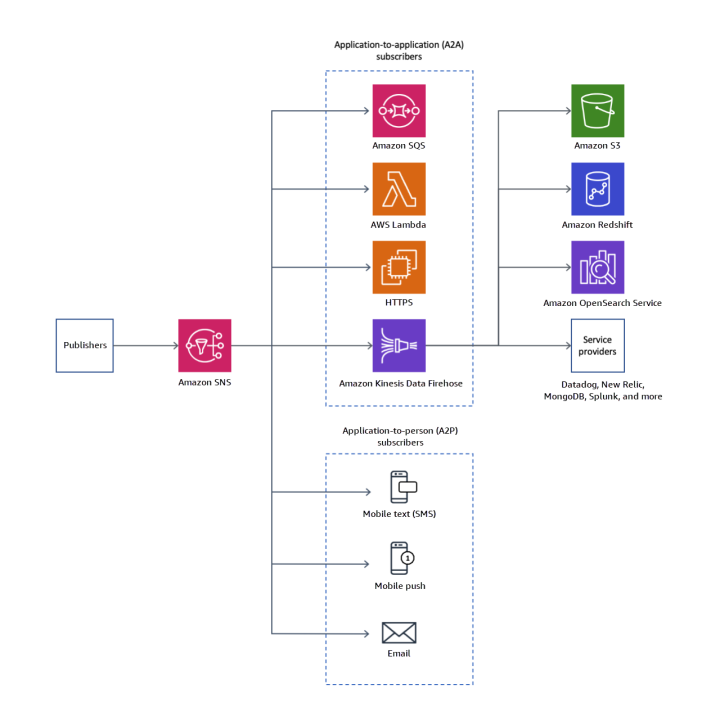
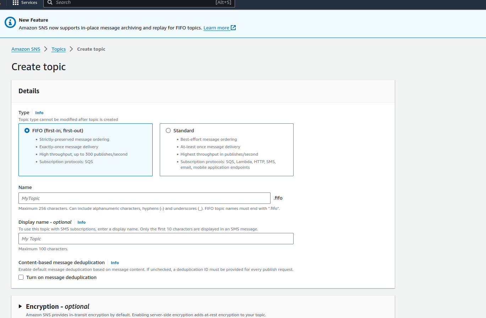
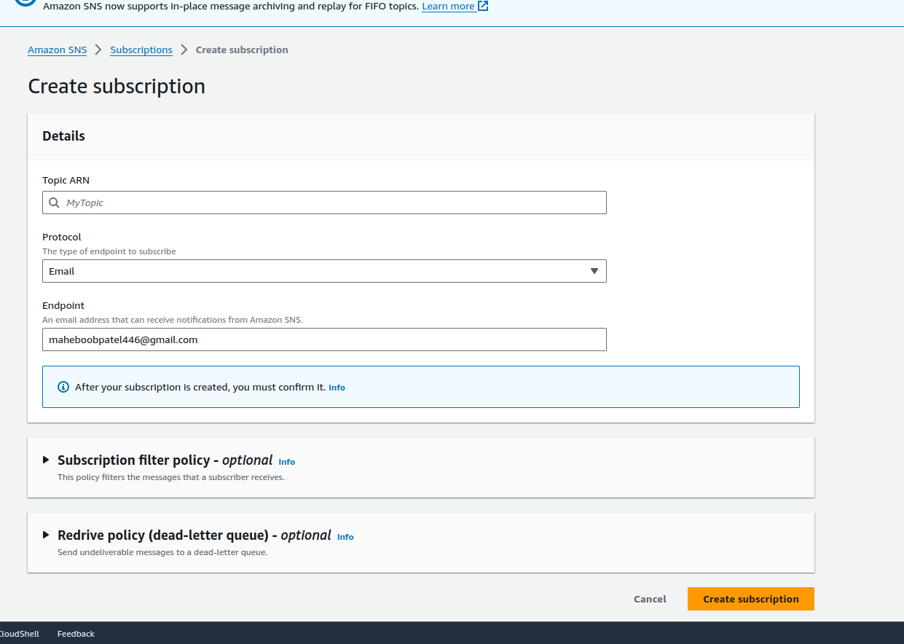
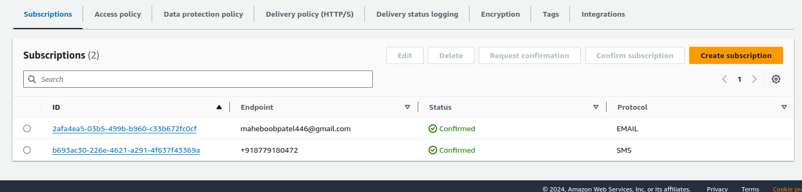
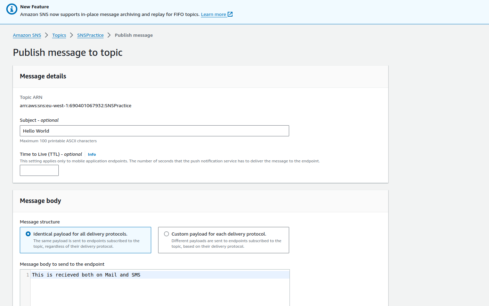
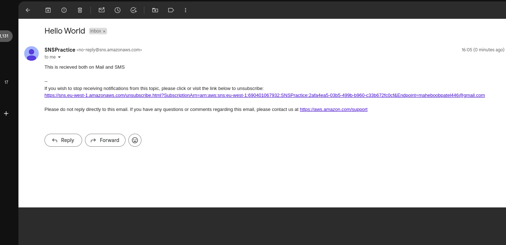
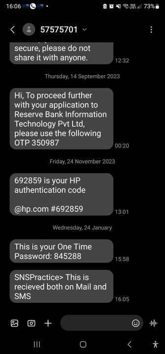

# AWS SNS


## SNS is known as Push service. <a name = "about"></a>

its mostly used in the scenarios where we have to broadcast messages since its known as
a PUSH service
it decouples the Pub(sender) & Sub(Reciever) in such a way that you can Publish Message to Speficic Topics and then Users Subscribed to that topic will recieve the Message simultaneously together rather than SQS in which the message is been put in a Queue in a sequence (LINEAR) way.

* User with AWS ID can request for subscriptions otherwise the Owner(who created the SNS Topic)
* have to manually add the endpoints like email & sms.

ARCHITECTURE:



### TOPIC--->Subscription(email & SMS) -->Publish Message


A step by step series of examples that tell you how to get a development env running.

Say what the step will be

```
Click on SNS create topic()
```


```
Click on Create Subscription 
```


* Similarly create subscription for SMS while selecting the protocol as SMS and adding up the phone number after verification

Here are the two subscriptions



Click on Publish Message under Topics to send a Message to the subscribers


End with an example of getting some data out of the system or using it for a little demo.

## Recieved Message Screenshot

Mail: 

SMS : 

